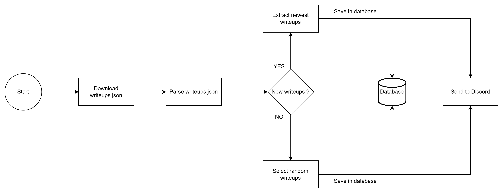

# Writeup-Miner-Daily-Read

## Introduction

Daily-Read is a tool that helps you know about the newest security articles and write-ups without you having to check lots of places yourself. It makes staying informed about security easy. The tool is designed to make the process simpler for you.

## Why Daily-Read?

Staying updated with what's new in cybersecurity is super important to keep your security strong. Reading articles and write-ups from different places is a good way to know what's going on. But it takes a lot of time to visit many websites. Daily-Read fixes this by doing it automatically. It gets the newest write-ups and sends them to your Discord server.

## How it Works

Daily-Read works by parsing a JSON file available at [https://pentester.land/writeups.json](https://pentester.land/writeups.json) to identify the newest write-ups. If new write-ups are found, they are sent directly to your Discord server. In the absence of new content, the tool randomly selects from existing write-ups to keep the flow of information constant.



## Options

- **-n**: Specify the number of write-ups to send to the Discord server.
- **-pdf**: Convert each write-up to PDF format before sending it to the Discord server.

## Getting Started

### Install pdfkit for PDF conversion

1. **Install pdfkit:**
```bash
   pip install pdfkit
   ```
   
```bash
   sudo apt-get install wkhtmltopdf   
   ```
   
   Follow for more information : [pdfkit](https://pypi.org/project/pdfkit/)


1. **Install the required dependencies:**

```bash
   pip install -r requirements.txt
   ```
2. **Open modules/variables.py and add your Discord webhook:**

```bash
   nano modules/variables.py
   discord_webhook = "Your Discord webhook"
  ```
  
3. **Run the tool ( send 10 writeups to your Discord server):**

```bash
   python3.11 daily-read.py -n 10
   ```
   
   * Send 10 writeups with its PDF to your Discord server
```bash
   python3.11 daily-read.py -n 10 -pdf
   ```
4. **Utilize a cronjob for ease of use:**
   * Run at 12:00 AM
```bash
   0 0 * * * cd /Path/To/Your/Writeup-Miner-Daily-Read/Folder && /Your/Python/Location daily-read.py -n 10 >> cronLog.txt
   ```
   * Example
```bash
   0 0 * * * cd /root/projects/Writeup-Miner-Daily-Read && /usr/bin/python3.11 daily-read.py -n 10 >> cronLog.txt
   ```
   
